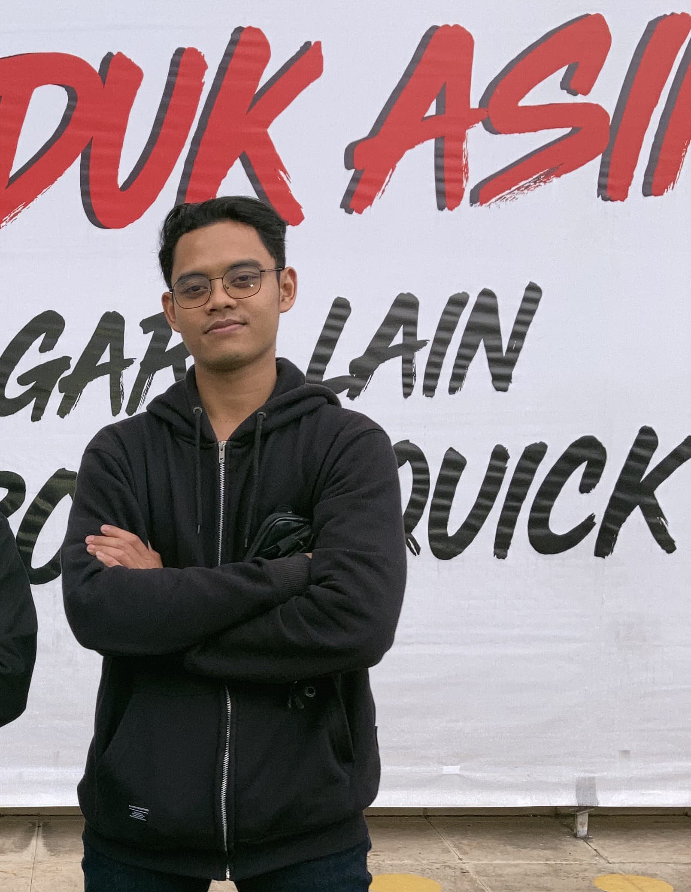

**🚀 Brian Dista S.B. — Personal Portfolio**  
Portfolio pribadi **Brian Dista Setya Budi**, seorang  **Technician Support & Server Engineer**.  
   
 Di-deploy menggunakan **GitHub Pages** sebagai static website.  
🌐 **Live:** [https://devopsbrian.github.io](https://devopsbrian.github.io "https://devopsbrian.github.io")  
  
**📁 Struktur Folder**  
portfolio/  
 ├── index.html          
 ├── style.css  
 ├── script.js  
 ├── foto.jpg  
 └── README.md  
   
  
**✨ Fitur**  
- **Sidebar navigasi** dengan avatar foto, nama, role, dan social links  
- **Typewriter effect** — teks profesi berganti otomatis  
- **Tech stack badges** — Kubernetes, PostgreSQL, Docker, Redis, Terraform  
- **Stats bar** — tahun pengalaman, proyek, dan tools  
- **Dark & elegant theme** dengan font Rajdhani + Share Tech Mono  
- **Responsive** — tampil baik di desktop maupun mobile  
- **Fully static** — tidak butuh backend atau server  
  
**🔗 Social Links**  
| | |  
|-|-|  
| **Platform** | **Link** |   
| GitHub | https://github.com/briandista24/ |   
| Email | [briandista024@gmail.com](mailto:briandista024@gmail.com "mailto:briandista024@gmail.com") |   
| WhatsApp | [wa.me/qr/YGTVTSKI42HWM1](https://wa.me/qr/YGTVTSKI42HWM1 "https://wa.me/qr/YGTVTSKI42HWM1") |   
   
  
**🛠️ Tech Stack**  
| | |  
|-|-|  
| **Teknologi** | **Kegunaan** |   
| HTML5 | Struktur halaman |   
| CSS3 | Styling, animasi, layout |   
| JavaScript (Vanilla) | Typewriter effect, nav aktif |   
| Google Fonts | Rajdhani + Share Tech Mono |   
| GitHub Pages | Hosting static site gratis |   
   
  
**🚀 Deploy ke GitHub Pages**  
**1. Clone / Upload repo**  
git clone https://github.com/devopsbrian/devopsbrian.github.io  
 cd devopsbrian.github.io  
   
**2. Tambahkan foto profil**  
Taruh foto kamu di root folder dengan nama foto.jpg:  
portfolio/  
 └── foto.jpg   ← taruh di sini  
   
Pastikan di index.html bagian avatar sudah pakai:  

  
     
 
  
   
**3. Push ke GitHub**  
git add .  
 git commit -m "feat: initial portfolio"  
 git push origin main  
   
**4. Aktifkan GitHub Pages**  
1. Buka repo di GitHub  
2. Klik **Settings** →  **Pages**  
3. Source: pilih **Deploy from a branch**  
4. Branch: **main** → folder:  **/ (root)**  
5. Klik **Save**  
Tunggu 1–2 menit, portfolio live di:  
https://devopsbrian.github.io  
   
  
**✏️ Cara Kustomisasi**  
**Ganti teks typewriter**  
Edit file script.js, ubah array roles:  
const roles = [  
   'DevOps Engineer',  
   'Database Engineer',  
   'CI/CD Specialist',  
   'Infrastructure Architect',  
   'Cloud Engineer',  
 ];  
   
**Ganti warna aksen**  
Edit file style.css, ubah variabel di :root:  
:root {  
   --accent:  #4f8ef7;   /* warna biru utama */  
   --accent2: #7de8c8;   /* warna hijau/teal */  
 }  
   
**Ganti angka statistik**  
Edit file index.html, cari bagian .stats-row:  

3+
  
 
Tahun Pengalaman
  
   
**Ganti tech stack badges**  
Edit file index.html, cari bagian .tech-strip:  

Kubernetes
  
   
  
**📄 Lisensi**  
MIT License — bebas digunakan dan dimodifikasi.  
  
*Dibuat dengan ❤️ oleh * ***Brian Dista Setya Budi***  
